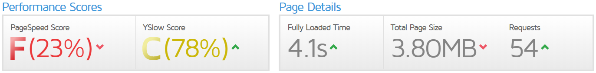
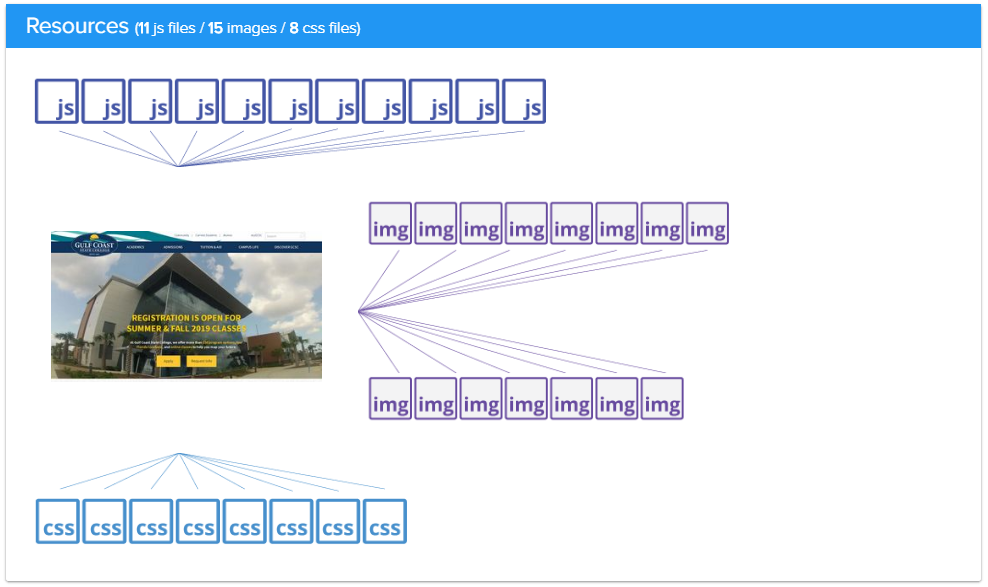
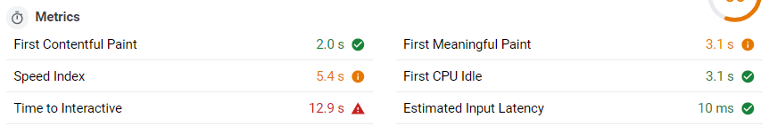

Now that we have the Gulf Coast State Collage website downloaded and re-hosted on our Netlify server, we can start running our audits. Auditing tools are the cornerstone of performing a web performance optimization. Without them you'd be shooting in the dark, even if you have a mastery of web performance concepts. They provide key metrics for understanding the current state of your web performance and allow you to measure progresses. Most of these tools give grades or scores across general areas of web performance, as well as a list of issues in each categories and details on the steps needed to remedy them.

But what tools should you use? There is no totally clear answer here, because there are more auditing tools than you'll ever have time to use and each have their own biases and pitfalls that you only discover after repeated use. The tools we'll be using for this project are my personal favorites that don't involve downloading packages and running command line functions - although those would be my preference in a production site for continuous monitoring. 

The tools for this audit are as follows...

- [web.dev](https://web.dev/measure) | Google's auditing service that runs on [Lighthouse](https://developers.google.com/web/tools/lighthouse/)
- [GTmetrix](https://gtmetrix.com) | A tried and true staple for measuring web performance
- [Vary Pagespeed](https://varvy.com/pagespeed/) | An interesting tool with unique visualizations of perf metrics

Between these tools you'll have everything you need to get 99% of the way to awesome web performance. An interesting tool that may or may not be use in future versions of this guide is [webhint](https://webhint.io), which contains a lot of tests not found in the other tools.

## GTmetrix Results

The initial version of the GCSC homepage can be found at [gcsc-site-0.gcscperfplus.com](https://gcsc-site-0.gcscperfplus.com/), the url we'll be testing here. Go ahead and run an audit on that link yourself to follow along with. 

The two main tabs we're concerned with here are the "PageSpeed" tab, and the "YSlow" tab, which are different types of performance rubrics. These two scores are so bad your paranoid of google, confused by a kindle grandma could tell you that something is wrong. PageSpeed is ranked at F(23%), yet YSlow is a C(78%) - so why is that? PageSpeed is concerned with the code on the page, while YSlow is focused more on the server side of things which has been mostly handled by Netlify automatically. In this case we're mostly interested in the PageSpeed section.

Take note of the "Page Details" as well. The page is fully loaded in 4.1 seconds, which is unacceptable and means the site is *categorically slow*. The page site is 3.8MBs with 54 requests. This can certainly be trimmed down.

Feel free to go ahead and look through the recommendations, but we'll cover them one by one in the optimization section.

## Vary PageSpeed Results

The summary of Vary's results is a quick checklist that can point you towards problem areas. The 4 you'll notice here are render blocking CSS/JS, unoptimized images, and unminified CSS/JS. These certainly aren't the only issues, but spoiler alert - fixing these issues will result in at least 80% of the performance gains.

### Analyzing the main resources

The Resources section is a great overview of the assets being pulled in to your page. Here we see that there are 11 JavaScript files, 15 images, and 8 stylesheets. This tells us that there is no sort of asset bundling going on on this site, which is a real shame. Each one of these requests takes time, and the magnification and optimization gains are better for one larger file than they are on several small ones. If this site used http2, or initial render prioritized code splitting these numbers would tell a different story, but it doesn't.

#### CSS delivery

The CSS delivery section shows us that the total size of the stylesheet payload is 189k, with all 8 of these stylesheets being render blocking assets. 

Now let's stop for a moment and examine that term, "render blocking". After the html file is downloaded, the browser starts to parse it. Every time the browser comes to a linked resource like a stylesheet or a script, it will pause the rendering of the page until that file is downloaded and parsed. This involves connecting to a new host if the file isn't hosted on the same server as the site, downloading the file, reading the file - and if some rendering has already taken place and the downloaded file changes the presentation a repaint will have to take place. Each of these steps takes time, and they happen 8 times before the first splash of color is shown to the user despite all of the html content being available.

5 of the 8 CSS files are under 10kb, which means the time spent downloading and parsing here is for a very small aspect of the end result. Two of the files are of a "medium" size, which in my experience means one file sets a bunch of style rules and the other overwrites many of them as customizations to the base style, which also takes more time.

#### JavaScript Delivery

The JavaScript delivery is even worse because scripts require more power to parse and also need to be executed. The payload here is at 243k, which is fairly large considering this page has fairly minimal interactive features and isn't some kind of application. There are 11 scripts being loaded, 9 of which are render blocking.

The two largest of these are foundation (96k), the frontend framework, and jQuery (84k). Now before I let my bias show and rip these choices of libraries and their implementation apart, let me say that both Foundation and jQuery are wonderful libraries that have pushed the web to where it is today and their creators should be respected and praised. Now that's out of the way, they shouldn't be used this way, and in my opinion shouldn't be here at all. 

These libraries allow for faster development, but they are heavy and slow. On this page 80% of the code in foundation is unused, and 47% of the code in jQuery is unused. That's 117kb of wasted space that the browser had to download and parse, for features that could be done with native JavaScript in a fraction of the space. jQuery is also a library that gets included and never updated, in this case the version used, 2.1.4, was released in April of 2015. That's four years ago as of the time this was written. This version includes security vulnerabilities and isn't near as optimized as the newest version, 3.4.1.

## Web.dev Results

Lighthouse - the tool web.dev uses - is my favorite of the auditing tools. It's scores are the ones that influence your Google ranking, and also influence your quality score on Google Ads. It's also an all around great tool for getting metrics and identifying specific issues.

The scores found along the top are a great overview. This version of the *GCSC Perf + Report* is currently only covering the performance section, but will be updated in the future to include the latter 3 as well. You really want to shoot for a performance score of 90, with anything under 80 being critically important to fix.

### Lighthouse Performance Metrics

So when you first see these numbers you'll be a little confused, so let's do a quick overview and I'll include links for more thorough explanations.

- [First Contentful Paint](https://developers.google.com/web/tools/lighthouse/audits/first-contentful-paint?utm_source=lighthouse&utm_medium=unknown)
  This is the time when the first image or text is painted to the screen. Getting rid of render blocking resources is key to getting this number down.
- [First Meaningful Paint](https://developers.google.com/web/tools/lighthouse/audits/first-meaningful-paint?utm_source=lighthouse&utm_medium=unknown)
  This is when the primary content above the fold is fully visible.
- [Speed Index](https://developers.google.com/web/tools/lighthouse/audits/speed-index?utm_source=lighthouse&utm_medium=unknown)
  This is how fast the content on a page appears.
- [Time to Interactive](https://developers.google.com/web/tools/lighthouse/audits/consistently-interactive?utm_source=lighthouse&utm_medium=unknown)
  This is the time that it takes for every item on the screen to become fully interactive, which can be anything from links working to carrousels being live.
- [First CPU Idle](https://developers.google.com/web/tools/lighthouse/audits/first-interactive?utm_source=lighthouse&utm_medium=unknown)
  This marks when the main thread of the page is low enough for input.

You want each one of these as low as possible, but the most important are the first contentful paint, and the first meaningful paint, in that order. The white loading screen is death to your user retention, so every bit of visual information should appear as fast as possible to keep the user engaged. If they see a skeleton loading screen they're more likely to wait the remainder of the time for the full page than if they see white until everything is ready.

Here there is way too much of a delay before the first content is painted to the screen. We want to get that down to one strip, and the second stage either gone or 1-2 strips in length as well.

### The opportunities

This is were we start to dive in to what needs to be done. As a side note, the estimated savings is a bit of a weird metric because the page didn't take 15.45 seconds to load despite that number being listed, but if you view it in a more relative way it can be useful. Now let's look at the problems.

1. Defer offscreen images | *15.45 s*
2. Serve images in next-gen formats| *12.6 s*
3. Efficiently encode images | *9.3 s*
4. Properly size images | *9.15 s*
5. Eliminate render-blocking resources | *.63 s*

So it looks like the majority of the issues here are images right? Well that's a pretty typical issue on sites. Fixing these will shave a huge amount of time off. But I want to state now, that this shouldn't be an issue to begin with and performance optimizations don't stop with images. You might cut page load times in half by fixing the images and think you're done, but in highly competitive situations like ecommerce you'll be fighting for 1/10th of a second to gain an edge.
