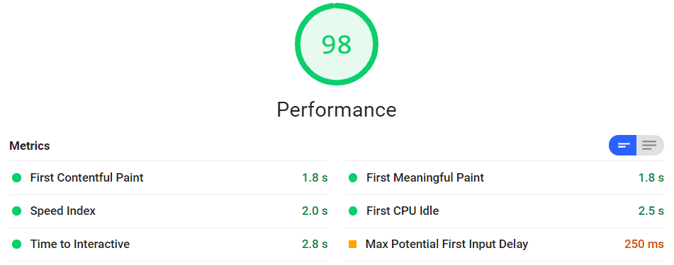
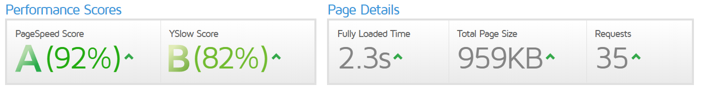

This is the section of the GCSC Perf+ where we'll finish our performance optimizations. If you haven't read the introduction to this project I recommend you start there. The current version of this project ends here, but it is still a work in progress. Expect further performance gains in future versions of this project, and the addition of the "accessibility" and "best practices" sections.

Now the previous optimizations took us a long way, but they were just the first part of the process. Feel free to run a new series of audits on https://gcsc-site-1.gcscperfplus.com/ to get an idea of what we're currently looking at. This article is following the [gcsc-site-2](https://github.com/LaneLourcey/gcsc-perf-plus-capstone/tree/gcsc-site-2) branch of the [gcsc-perf-plus-capstone repository](https://github.com/LaneLourcey/gcsc-perf-plus-capstone), so check out the commits page of that branch to follow along.

## Render Blocking Resource Elimination

Alright the next issue we're going to be addressing is the elimination of render-blocking resources. We mentioned in the audit section that assets like scripts and stylesheets had to be downloaded and parsed before the page rendering could be continued, and went into a fair amount of detail on that process so if you missed that section check it out so that you understand why we need to fix this issue.

Before we get to the main problem, I noticed we're calling some files that don't exist somewhere in our document. [This commit](https://github.com/LaneLourcey/gcsc-perf-plus-capstone/commit/9a2918a8c7db60f6042afb356d05a9d2df4ab73b) addresses the issue, but to summarize the "vegas" script that litters this document is apparently some background video loader that isn't actually working on the page. A lot of the markup and CSS rules reference this script so instead of removing it I commented out the line of script that calls these files that were erroring out in the console - boom, three requests eliminated.

### Inlining small scripts required for pageload

Now another easy win right off the bat can be to inline the two scripts we added last time - "Modernizer" & "yall.js" - into the HTML document. The reason we want to take this particular approach is a nuanced issue that we'll explore briefly before taking action. when you have a render blocking resource you can two options, move the resource to the bottom of the document so that the page loads before it, or inline it. For huge files like the main CSS or JS inlining would add a lot of weight to the initial HTML payload, which we want to keep as small as possible. But for small scripts that are required for the page to function, like analytics trackers or the two we added in the last stage, inlining is the perfect compromise.

To inline the scripts simply copy the contents of the files, and paste them in a `<script>` tag, then remove their refences in the HTML. This example abbreviates the inlined scripts, but you can [see the actual difference here.](https://github.com/LaneLourcey/gcsc-perf-plus-capstone/commit/6e7e00dfc7937ea04606bab2b8ac8d59aa458095)

```html
<script src="_resources/js/modernizr-custom.js"></script>
<script src="_resources/js/yall.min.js"></script>
<!-- Inlining the scripts -->
<script>
  /*! modernizr 3.6.0 (Custom Build) | MIT *
  * https://modernizr.com/download/?-webp-setclasses !*/
  !function(e,n,A){function o(e,n)...
</script>
<script>
  var yall = function () {...}
  document.addEventListener("DOMContentLoaded", yall);
</script>
```

There, two render blocking requests down.

### Managing the render blocking CSS

Okay so we're going to tackle the CSS files that hold up our render times now. But before we actually start doing anything to the CSS, we need to validate the two main stylesheets. Why? Because any sort of optimizations that we also want to apply work best when they're fed a clean stylesheet with no errors. So the first step here is to use a online [CSS validation tool](https://www.cssportal.com/css-validator/).

Looks like 2 warnings were found in `app-2.css`, which have to do with flexbox properties being used with the wrong display type. 7 warnings were found in `gcsc-global.css`, which were related to properties outside of selectors - also known as typos and syntax errors. You can see the changes made to the css files in [this commit](https://github.com/LaneLourcey/gcsc-perf-plus-capstone/commit/a4db68ad10ff3072aa10b2ac39cf408f9044618b), and the follow example shows a couple of the errors mentioned.

```css
/* This is an example of incorrect syntax in app-2.css */
img {
  max-eidth: 100%!important
}@    page { /* Here is the issue */
  margin: .5cm
}

/* It was fixed by commenting out the offending section */
img {
  max-eidth: 100%!important
}
/* @    page {
  margin: .5cm
}*/
```

```css
/* This example contains HTML style comments in CSS */
#navlist li {
  line-height: 1.2;
  <!--margin-bottom: 0.875rem;
  -->margin-bottom: 0;
}

/* The fix here is obvious, to use CSS style comments */
#navlist li {
  line-height: 1.2;
  /*margin-bottom: .875rem;*/
  margin-bottom: 0;
}
```

You'll see errors like these build up from time to time, and they can effect the codebase in unexpected ways, especially when another tool transforms the code in some way. They also slow down browsers to some degree, and are a waste of space - no matter how small.

### Prep Work: Optimizing the CSS files

Now that the errors are out of the way, let's go over the game plan for how we're going to treat then load these CSS files files to optimize performance. You can see [this step at the github commit](https://github.com/LaneLourcey/gcsc-perf-plus-capstone/commit/b615a70972c5cafdddfdc60b40670e646c346589). The first thing we're going to do is optimize our two main CSS files with [CSS Portal's CSS Optimizer](https://www.cssportal.com/css-optimize/). This tool applies transformations to the codebase to shrink our css file size, and potentially help it load faster. These transformations include things like optimizing shorthand notation for rules, regrouping selectors, and sorting our css properties to save even more space during gzip compression.

Take a look at the results of a basic optimization at standard compression.

|                   | Input   | Output  | Compression Ratio |
| ----------------- | ------- | ------- | ----------------- |
| `app-2.css`       | 96.69KB | 73.07KB | 24.4% (-23.62KB)  |
| `gcsc-global.css` | 54.42KB | 41.12KB | 24.4% (-13.30KB)  |

---

The next step is to take all of the css files that are loaded in the head of our document, merge them into a single CSS file, and optimize that file. This is sort of a shotgun approach to the CSS aspect of web performance because there can be other methodologies that are better, but they're more complicated and can result in minimal gains if any.

The tool we'll be using for this step is [CSSO](https://css.github.io/csso/csso.html), self described as a "CSS minifier with structural optimizations". I like it for this project because the web interface allows us to paste the contents of all our css files in - in the same order they're loaded - and gives us a single wall of code to paste in a new file. The files we'll including are as follows:

1. `app-2.css`
2. `gcsc-global.css`
3. `ourstyles.css`
4. `slick.css`
5. `slick-theme.css`
6. `vegas.min.css`

The total size of these stylesheets sits at **133KB**, but after being merged and ran through _CSSO_ the size of our new, singular stylesheet is **108KB**. So we shaved off an additional 25KB and reduced our requests by 5! This step of the process can be seen at this [GitHub commit](https://github.com/LaneLourcey/gcsc-perf-plus-capstone/commit/4d29d3ec7f5d79cc507e863ccfc37d9789e7629f). Don't forget to remove the old stylesheet calls in your HTML and replace them with the new file.

```html
<!-- Remove these links -->
<link href="_resources/css/app-2.css" rel="stylesheet" />
<link href="_resources/css/gcsc-global.css" rel="stylesheet" />
<link rel="stylesheet" href="_resources/css/oustyles.css" />
<link rel="stylesheet" type="text/css" href="_resources/slick/slick.css" />
<link
  rel="stylesheet"
  type="text/css"
  href="_resources/slick/slick-theme.css"
/>
<link rel="stylesheet" href="_resources/vegas/vegas.min.css" />

<!-- Add the new stylesheet -->
<link href="_resources/css/styles.min.css" rel="stylesheet" />
```

### The extra mile: Critical CSS

Okay so after that step of the process we've still got a render blocking resource, but the situation is much better. To finally put this render blocking resource issue to bed we're going to move our stylesheet to the bottom of the page, just before all the script tags, and then we're going to do apply a little techno-wizardry. Follow along at this [GitHub commit](https://github.com/LaneLourcey/gcsc-perf-plus-capstone/commit/5ed560a2a3c0755a0a826b12b96d0f43bbd78757).

**Critical path CSS** is a method of inlining all of the css rules needed for the first paint of above the fold content. This means the basic initial styles are downloaded along with the HTML document and are ready to go from the moment the page is loaded. We're going to be using [Sitelocity's Critical Path CSS Generator](https://www.sitelocity.com/critical-path-css-generator) tool to generate the Critical CSS, then including it in the head of our document. It's extremely simple to do, and can also be automated as part of your build process with [Critical](https://github.com/addyosmani/critical).

## Merging our JavaScript files

We're going to do the same thing we did before with our CSS files, to the JavaScript in our page. These aren't render blocking resources, but reducing the size of the page and the requests even further will help speed up our site even more. Before we start, I want to say once again that this is a shotgun style approach - a much better tool to use would be something like [Webpack](https://webpack.js.org/) and all of the enhancements it can offer. See the code for this step at the [Github commit](https://github.com/LaneLourcey/gcsc-perf-plus-capstone/commit/edfdad37d48d422a749988af9961993487fea580).

Okay so the current JavaScript payload consists of these files, in this order.

1. `jquery.min.js` | **84.38KB**
2. `what-input.js` | 4.73KB
3. `foundation.min.js` | **96.08KB**
4. `app-min.js` | 0.063KB
5. `gcsc-scripts-min.js` | 1.39KB
6. `direct-edit.js` | 0.57KB
7. `slick.min.js` | _40.46KB_

That comes out to a total payload of **227.67KB** across _7 requests_. One of these files is _.063KB_, which is a total waste of a trip to the server. After merging these files with [JSCompress](https://jscompress.com/) the resulting script comes out to **218KB**, which isn't much smaller but the savings in trips to the server was the main concern.

```html
<!-- Old Script loading
<script type="application/javascript" src="_resources/js/jquery.min.js"></script>
<script type="application/javascript" async src="_resources/js/what-input.min.js"></script>
<script type="application/javascript" src="_resources/js/foundation.min.js"></script>
<script type="application/javascript" async src="_resources/js/app-min.js"></script>
<script type="application/javascript" src="_resources/js/gcsc-scripts-min.js"></script>
<script type="application/javascript" src="_resources/js/direct-edit.js"></script>
<script src="_resources/slick/slick.min.js"></script>
-->

<!-- New script loading -->
<script
  type="application/javascript"
  src="_resources/js/compressed.js"
></script>
```

## Lightning fast at last

Now is the moment of truth. This is the last step in the process for this version of the project, although there are still many steps that could be taken. The steps taken so far can have a dramatic impact on your website if they haven't been done. Now on to the results.

[The lighthouse report](https://lighthouse-dot-webdotdevsite.appspot.com/lh/html?url=https://gcsc-site-2.gcscperfplus.com/) shows a performance score of 98! That's huge! Although it's worth noting there are many things that we haven't covered that can drive performance even farther.



[The GTmetrix report](https://gtmetrix.com/reports/gcsc-site-2.gcscperfplus.com/fj0oVgMh) shows a similarly awesome score!



Now let's compare our scores from when we started, with the current state.

|                                   | Initial | Current |
| --------------------------------- | ------- | ------- |
| Lighthouse<br />Performance Score | 64      | 98      |
| PageSpeed Score                   | F (23%) | A (92%) |
| YSlow Score                       | C (78%) | B (82%) |

Now let's see the difference in our actual speed metrics.

|                        | Initial | Current | Difference |
| ---------------------- | ------- | ------- | ---------- |
| Fully Loaded Time      | 4.1s    | 2.3s    | -1.8s      |
| Total Page Size        | 3.80MB  | 959KB   | -2.84MB    |
| Requests               | 54      | 35      | -19        |
| First Contentful Paint | 2.0s    | 1.8s    | -0.2       |
| First Meaningful Paint | 3.1s    | 1.8s    | -1.3       |
| Speed Index            | 3.7s    | 2.0s    | -1.7       |
| Time to Interactive    | 12.7s   | 2.8s    | -9.9s      |

That table puts things into perspective! While first contentful paint is only 10% faster, the first meaningful paint is much faster. The fully loaded time is also twice as fast, and the speed index is 4.5x faster! But a table can only tell so much of the story, and a picture is worth 1,000 words. So let's see what this speed increase looks like in real time.

<iframe width="560" height="315" src="https://www.youtube.com/embed/cA9NEtCHUpg" frameborder="0" allow="accelerometer; autoplay; encrypted-media; gyroscope; picture-in-picture" allowfullscreen></iframe>
