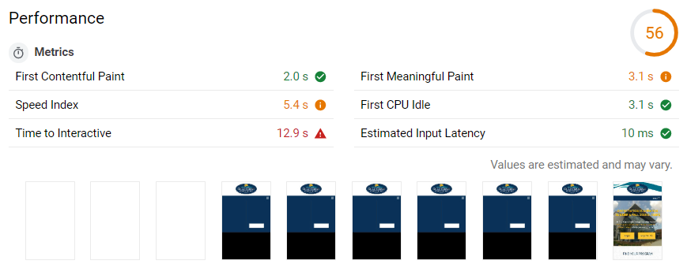
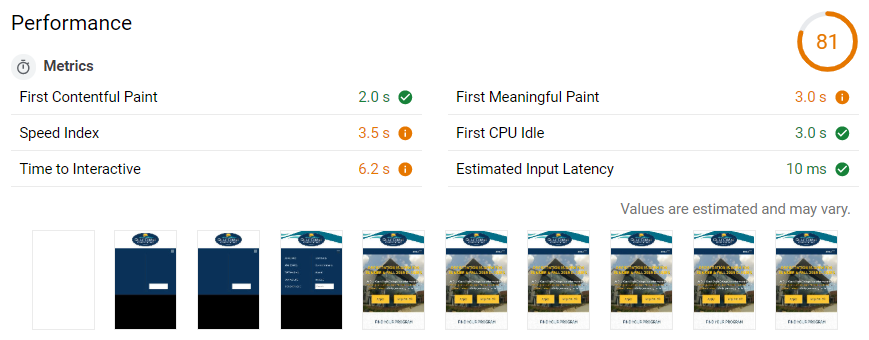
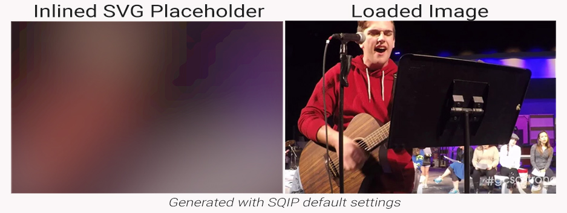

This is the first section of the GCSC Perf+ where we'll start on optimizations. If you haven't read the introduction to this project I recommend you start there. The results of our audit were overflowing with opportunities for optimization, so much so that it can be confusing where one should start. You could follow the suggestions offered by the lighthouse audit in order, which would have us "Defer offscreen images" first. I'd like to start with the 3^rd^ & 4^th^ opportunities: "Efficiently encode images", and "Properly size images".

## Properly sizing & compressing images on webpages

This seems obvious, but is easy to get caught up during the development process and include this mistake. You want to load images at the same resolution they're displayed at. If you load a 1000x1000px images and display it at 500x500px, 3/4ths of the pixels won't be displayed - which means you could use a much lighter file instead for the same result. It also means the device has to resize the image itself, which is another performance hit.

On this page there are 4 images that are being loaded at a much larger size than is required. The `careercoach.jpg` image alone is 400x2500px and weighs in at 1.29MBs. That single image is roughly the size we'd like to see the final page be.

The first step is to use our developer tools to find out the right size for each of these images that Lighthouse has pointed out to us. For example, the HTML for this page specifies that the `careercoach.jpg` image we looked at a moment ago should be 500x313px. Many sites need images of multiple sizes due to responsive design, but this page can get away with the desktop sizes on mobile devices as well.

After we use a image editing program to resize these images to the native resolution they'll be displayed at, we want to compress them. There are a ton of options for doing this, but we'll start with [TinyPNG](https://tinypng.com/) - however I encourage you to explore all of the great alternatives there are for image optimization because they each use different algorithms with varying results. You're looking for the best file size reduction for the lowest loss in quality. It's also worth noting here that a best practice would be to make image optimization a part of your build process, but that's beyond the scope of this project.

A quick side note before we move on, this quick process that didn't actually involve touching code took our lighthouse performance score from 56 to 81and improved our performance metrics significantly. Check it out, and never forgot your image optimizations!



`ADD SUBTITLE`



`ADD SUBTITLE`

## Serving images in next-gen formats: WebP

So the next opportunity lighthouse lists is serving images in [next generation formats](https://developers.google.com/web/tools/lighthouse/audits/webp). This is referring to Google's WebP image format, which is really efficient and can be significantly smaller than .jpeg or .png images. However, not all browsers support WebP images. Support sits at around 85% for global users as of writing this, which is actually pretty good. but we still don't want to leave this 15% of users behind - yet. So what we'll do is utilize the `<picture>` element in HTML and a script called [Modernizer](https://modernizr.com/) to determine if a browser supports WebP and react accordingly.

You can follow along with all of these changes at this [Git commit](https://github.com/LaneLourcey/gcsc-perf-plus-capstone/commit/97afbfc5cfc45b7f685f12c9ac6deea7ed970a3e).

### Adding fallback support in CSS for WebP images

Modernizer sets classes to the body element depending on the compatibility it detects. You'll want to use a custom build of modernizer for the features you want to detect, in this case just WebP. Then in your CSS you can prefix every image reference with the `.webp` or `.no-webp` selectors, and include the appropriate image in each. Here is an example of before, and after adding .webp support in our CSS.

```css
/* Before adding .webp support */
.top-bar {
  background: url(../img/bkgnd-wave-element-gcsc.png) no-repeat -300px -10px;
}

/* With .webp support */
.no-webp .top-bar {
  background: url(../img/bkgnd-wave-element-gcsc.png) no-repeat -300px -10px;
}
.webp .top-bar {
  background: url(../img/bkgnd-wave-element-gcsc.webp) no-repeat -300px -10px;
}
```

Just make sure you download the modernizer script, throw it in your "js" folder, and link to the script in the head of your HTML document.

```html
<script src="_resources/js/modernizr-custom.js"></script>
```

### Adding fallback support in HTML for WebP images

Now we need to tell browsers to download the correct image in our HTML document. We can do that with the [`<picture>`](https://developer.mozilla.org/en-US/docs/Web/HTML/Element/picture) element. This element was included in HTML5 and is basically a wrapper around the `` element that can optionally take a [`<source>`](https://developer.mozilla.org/en-US/docs/Web/HTML/Element/source) element. The `<source>` element holds the alternative file you'd like to load - if possible. So browsers without support will skip to the `` element, but browsers with support will load from the `<source>` and skip the ``'s `src` attribute. Let's look at an example from our site:

```html
<!-- Before WebP support with the <picture> element -->


<!-- After WebP support with the <picture> element -->
<picture>
  <source
    srcset="_resources/images/photos/two-female-students.webp"
    type="image/webp"
  />
  
</picture>
```

If you're following along in the Github commit, you'll notice I added two `<source>` elements, one with the WebP image and one with the original JPEG image. This was a mistake, you don't need to include the original as a source as well - although it doesn't cause any issues, it's unnecessary code.

Also take note of the `srcset` and `type` attributes of the `<source>` element. `srcset` is the same as `src` in an `` element, and `type` is the kind of file you'll be loading.

## Lazy Loading our WebP images with fallback support & svg placeholders

Okay that headline is a mouthful, and might seem daunting, but this is where performance can really start to take off. Right now every image is being downloaded all at once along with the page, but what we'd rather have happen is to load our images as they enter the viewport and save the unnecessary downloads. Enter _"Lazy Loading"_.

Lazy Loading is done with JavaScript and basically involves moving our `` element's `src` to a different attribute so that the browser doesn't download any images initially. Then the script will move the image sources back to the `src` attribute as the image enters the viewport so that the browser will start downloading them. That's really great, but it can be even better with svg placeholders.

### SVG Placeholders with SQIP

SVG files are vector graphics and they can be inlined right into an image element so no extra requests need to take place. [SQIP](https://github.com/axe312ger/sqip) is a tool that generates a simplified low-poly version of an image to use as a placeholder while images are being downloaded. It involves some use of the command line but the instructions on the Github page are extremely easy to follow.

The included output of SQIP in a `` element looks like this...

```html

```

The "..." abbreviates the actual code that you can follow along with at the [Github commit](https://github.com/LaneLourcey/gcsc-perf-plus-capstone/commit/1c9c1b05f7a995bb516aaa7f840da96acc92dc2b). Including all of this base64 image data adds a little weight to our initial HTML payload, but it also enhances user experience quite a bit on slow networks. Instead of seeing a blank frame, a user will see this:



While it isn't winning any awards in an art gallery it's not bad for almost no effort. You can play around with the settings you pass SQIP to get better results, but the main point is that it's small and not a clear frame where a picture should be.

### Lazy Loading with yall.js

[yall.js](https://github.com/malchata/yall.js) is an awesome lazy loader script that we're going to be using here. There are plenty of alternative options on Github, but yall works perfectly in this case. To include it download the production script from it's [dist directory](https://github.com/malchata/yall.js/tree/master/dist) and add it to the js folder in your project, add it to the html document, and then call it right afterwards with a `<script>` element.

```html
<script src="_resources/js/yall.min.js"></script>
<script>
  document.addEventListener('DOMContentLoaded', yall);
</script>
```

Alright so everything is done and our images are lazy loaded, right!? Not yet. We have to make some changes to our `` & `<picture>` elements. For the `<picture>` elements that contain our _WebP_ and _JPEG_ fallback images we need to make the following changes.

1. Change the `srcset` attribute to `data-srcset` on our `<source>` elements.
   `<source srcset="some-image.pic" ...>` => `<source data-srcset="some-image.pic" ...>`
2. Add `class="lazy"` to the `` element, and change `src` to `data-srcset`
3. Add a new `src` attribute to the `` elements that contains our base64 svg placeholder data
   ``

```html
<!-- Before Lazy Loading with SVG Placeholders -->
<picture>
  <source
    srcset="_resources/images/photos/two-female-students.webp"
    type="image/webp"
  />
  
</picture>

<!-- After Lazy Loading with SVG Placeholders -->
<picture>
  <source
    data-srcset="_resources/images/photos/two-female-students.webp"
    type="image/webp"
  />
  
</picture>
```

That's it for the `<picture>` elements, but now we need to do something for all of the images that didn't have WebP fallbacks. Luckily the process is almost exactly the same, minus the first step.

1. Add `class="lazy"` to the `` element, and change `src` to `data-srcset`
2. Add a new `src` attribute to the `` elements that contains our base64 svg placeholder data
   ``

and we're done with our image optimization! Let's look at the results.

## Analyzing the results of optimizing images for web performance.

Okay so to recap we went through the following steps...

1. Resized images to the native resolution they're loaded at.
2. Compressed the images to reduce their file size
3. Generated WebP versions of the largest images and served the origionals as fallbacks with `<picture>` and help from _Modernizer_.
4. Lazy Loaded the images with _yall.js_ and served SVG placeholders generated with _SQIP_.

That was a decent amount of work, but in production and on large sites you can add this workflow to your build process and template files, automating that work so you really only have to do it once. Now let's see the results of our efforts.

The [GTmetrix](https://gtmetrix.com) score [went from this result](https://gtmetrix.com/reports/gcsc-site-0.gcscperfplus.com/cMrRYRKV), to a [much better looking performance profile](https://gtmetrix.com/reports/gcsc-site-1.gcscperfplus.com/rLBNRP3W).

| GTmetrix Results  | Initial Site | Stage 1 Outcome |
| ----------------- | ------------ | --------------- |
| PageSpeed         | F 23%        | A 91%           |
| YSlow             | C 78%        | C 76%           |
| Fully Loaded Time | 4.1s         | 2.7s            |
| Total Page Size   | 3.80MB       | 1.03MB          |
| Requests          | 54           | 56              |

Let's go over these two sets of results for a moment. PageSpeed's difference is obvious, I mean an "A" always speaks for itself. But, YSlow went down - what gives? Who knows, you could fret of what went wrong and resulted in a 2% drop - comparing the recommendations of both to see where the drop lies - or you could take this change with a grain of salt and pay attention to the actual metrics... Fully Loaded Time is down 1.4 seconds! That's somewhere around a 40% drop in the user's wait time! The page size is down to nearly 1/4^th^ of the initial size, despite adding two more requests.

The Lighthouse score at web.dev is up to 88 from 56! That's very close to the green zone! But next up is where you'll actually see real performance gains that will give you an advantage over the competition and help you reach the most of your potential user base.
